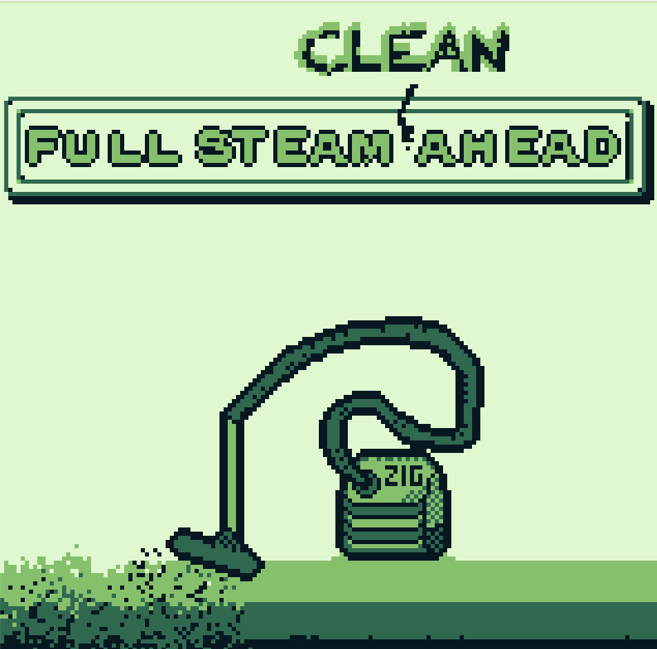
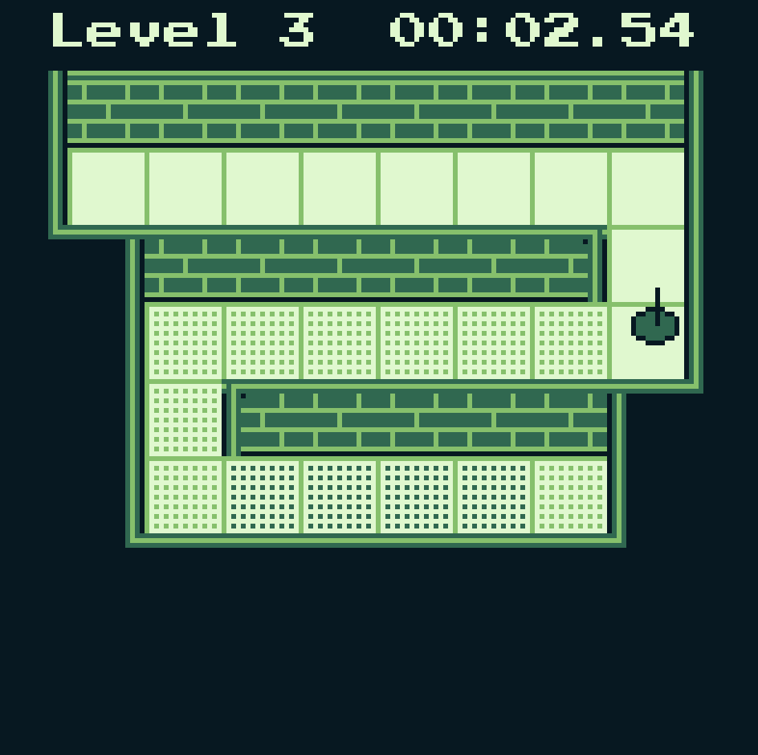

# Zero Sugar Added (1st Edition)

> Full steam ahead!

## Full Steam (Clean) Ahead

[Play in your browser](https://kurtwagner.github.io/gamejams/zero-sugar-added/editions/1-w4/)



## Build and run

Using zig (0.17.x) and w4. Run with:

```shell
zig build run
```

## Deploy to HTML

Build the standalone web page with:

```shell
zig build deploy
```
